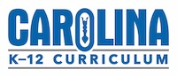

## Exhibitors

Here are our awesome exhibitors, check them out. Yada yada.

### Active Learning

Lorem ipsum dolor

### Carolina Biological Supply

From its beginnings in 1927, [Carolina](http://www.carolina.com) has grown to become the leading supplier of science teaching materials in the world. Headquartered in Burlington, NC, Carolina serves customers worldwide, including teachers, students, and professionals in science and health-related fields. The company is still privately owned by descendants of the founder, geology and biology professor Dr. Thomas E. Powell Jr.
 
[Carolina K-8 Curricular Programs](https://www.carolina.com/k-8-curriculum-programs)

### Friends of the Gallatin National Forest Avalanche Center

Lorem ipsum dolor

### Montana NSF EPSCoR

Lorem ipsum dolor

### Montana Robotics Alliance

Lorem ipsum dolor

### MSU Applied Quantum Core

Lorem ipsum dolor

### MSU Norm Asbornson College of Engineering

[Information]( https://coe.montana.edu/outreach/index.html) about outreach at MSU Norm Asbornson College of Engineering

### Museum of the Rockies

Lorem ipsum dolor